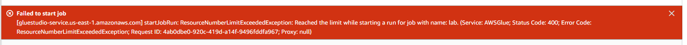
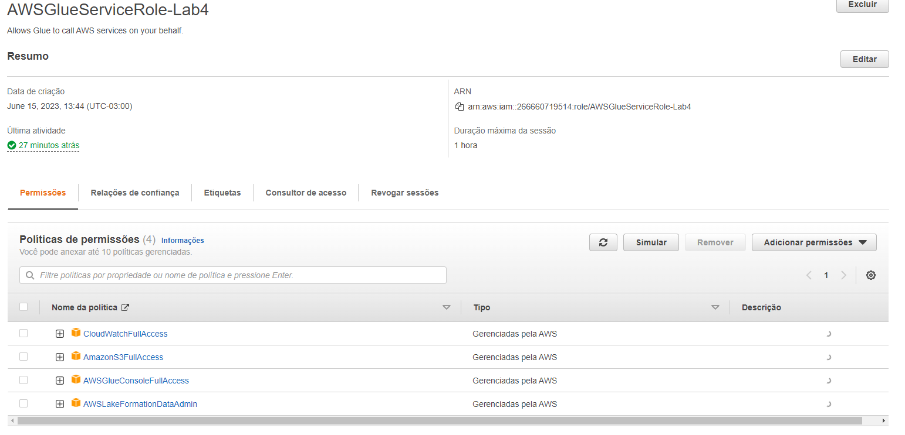
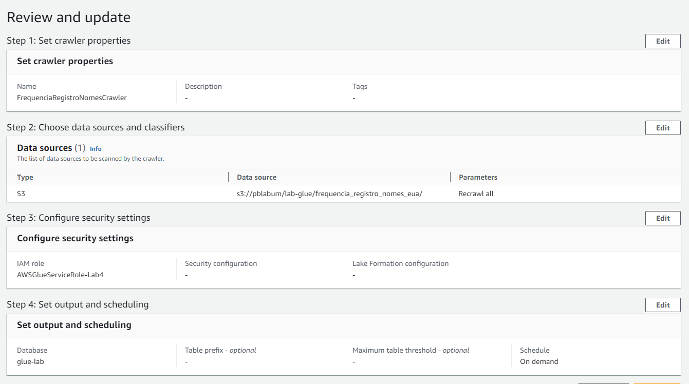
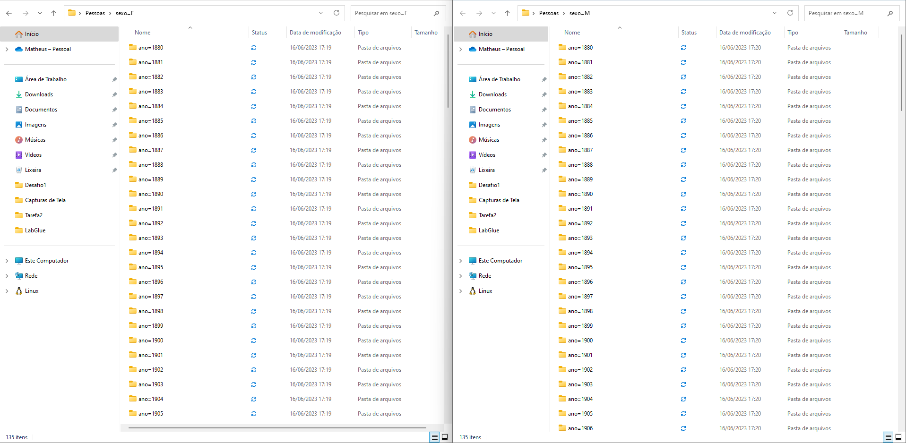
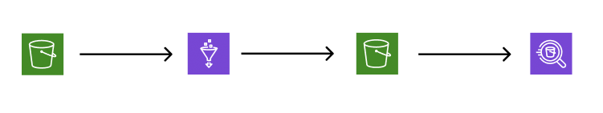

# Lab Glue

- Tive dificuldades devido entendimento de ínicio e logo depois não puder realizar as atividades em minha conta.

- Role criada.

- Crawler e Database.

- Particionamento.

  - Rodei o particionamento em um Container, ao enviar para o S3 o Crawler não reconheceu corretamente os arquivos criando uma tabela pra cada arquivo, diferente do Heliton que estava comigo na execução, por isso não tenho prints referente ao Athena, mas tentarei fazer algo.

- Fluxo

