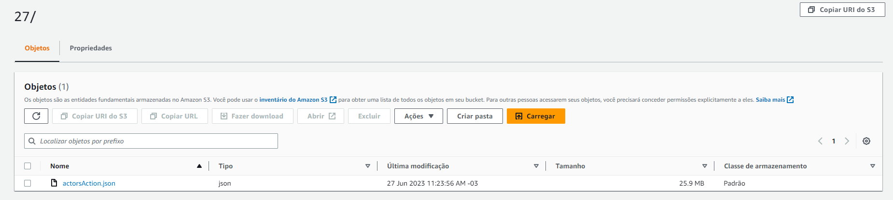

# Desafio 
#### Parte II

Pretendo fazer um recorte buscando por atores que fizeram muitos filmes pelo gênero em um determinado período. E fazer comparação entre os filmes que estes atores/atrizes participaram.

[Fonte dos atores retirados](https://cinepop.com.br/os-10-maiores-astros-de-acao-105537/)

[Fonte das atrizes retiradas](https://cinepop.com.br/as-10-maiores-atrizes-de-acao-106112/)

Libs Utilizadas

        requests
        datetime
        boto3
        json
        os
        botocore.exceptions

[Script Python](https://github.com/MatheusSanteago/Sprints-CompassUOL/blob/main/Sprint8/Desafio-ParteII/main.py)

Comandos utilzados para criar a camada
[Dockerfile utilizado](https://github.com/MatheusSanteago/Sprints-CompassUOL/blob/main/Sprint8/Desafio-ParteII/Dockerfile)

          python3 -m venv venv
          mkdir python
          cd python
          pip install <lib-name> -t .
          cd .. 
          zip layer2.zip python
          docker cp 08b:/tmp/packages/layer2.zip ./
Camada no Console da AWS

Execução da função no AWS Lambda

Resultado no S3 

