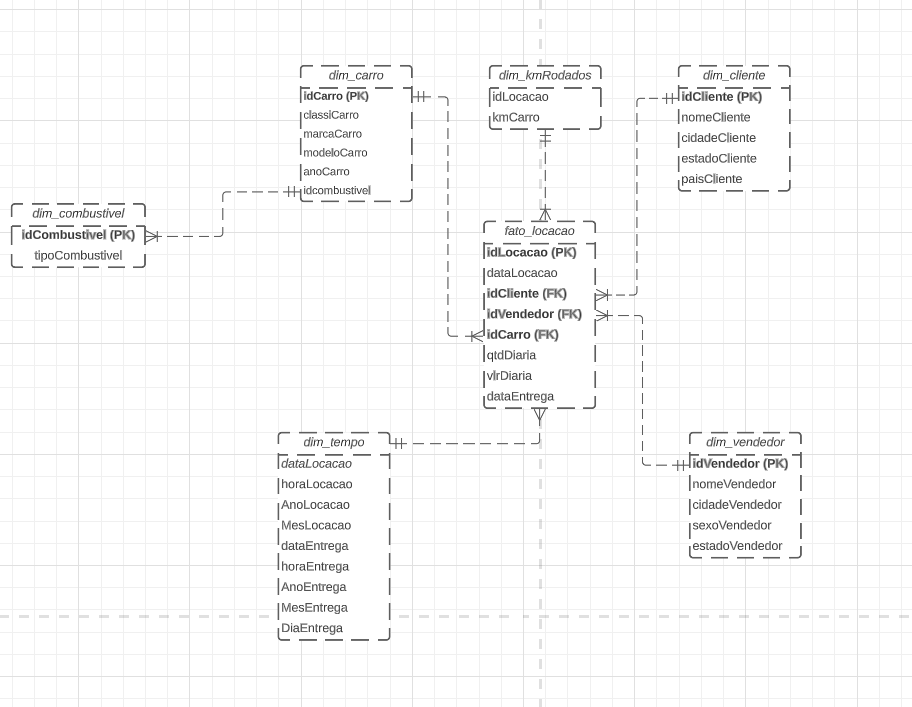

### Modelagem Lógica

##### Comentários 

Optei por fazer Snowflake, pois a dim_combustivel está ligada a dim_carro, tendo em vista que é o tipo de combustível usado pelo carro.

Separei as dimensões em sua maioria levando em considerando as características de cada item no banco de dados, optei em fazer a dim_kmRodados ligando a KmCarro com o idLocacao na tabela fato_locacao, não seria possível ligar com os carros diretamente pois a tabela dim_carro foi normalizada na tabela anterior.
