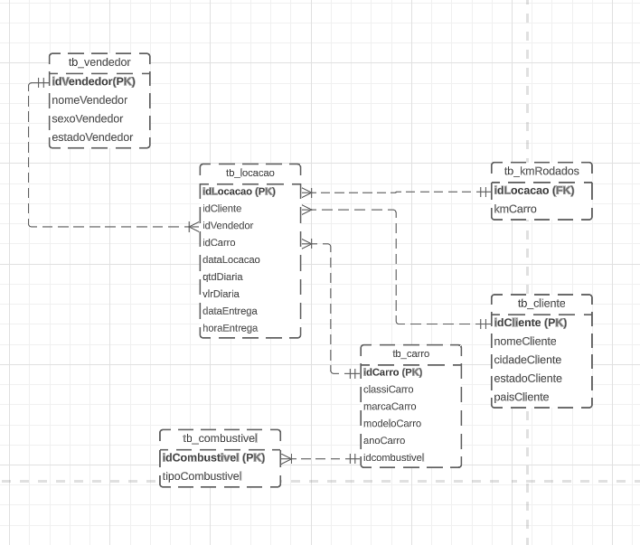

# Modelagem Relacional

##### Modelagem Lógica

##### Comentários 

Normalizei o registro KmCarro pois se trata de um dado multi-valorado, até poderia ser feita uma abastração do mesmo e colocando a maior Km junto ao Carro em sua respectiva tabela, porém outros dados seriam perdidos, com isso deixei a tb_kmRodados ligada na tabela tb_locacao uma vez que a tabela de carros está normalizada.