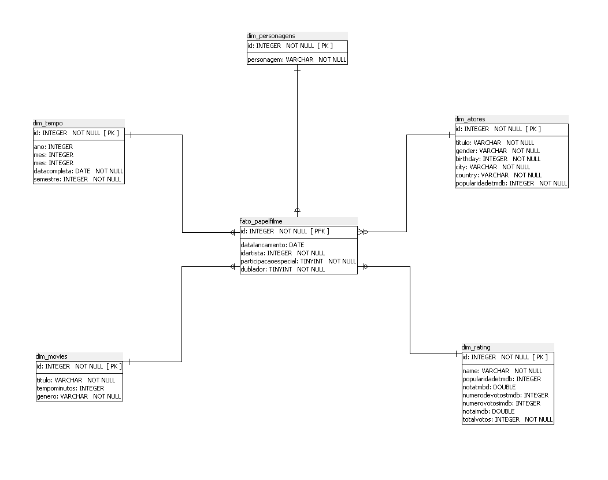
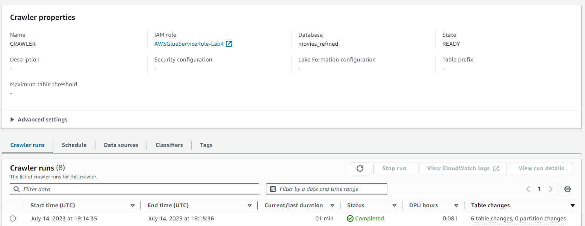
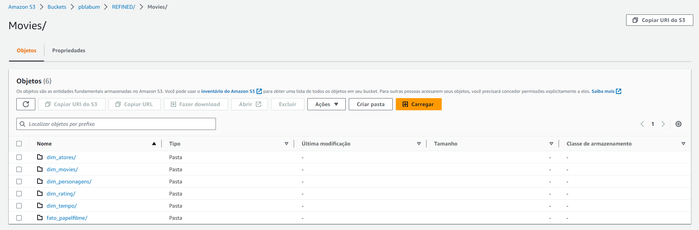

# Desafio

##### Parte 3
 

##### Trusted

Na primeira etapa a finalidade era tratar os dados vindo da RAW e enviar o mesmo para a camada TRUSTED.

[Scripts Glue - Trusted](https://github.com/MatheusSanteago/Sprints-CompassUOL/tree/main/Sprint9/Desafio/ToTrusted)

Para catalogar esses códigos para ter uma visão referente ao desejado na refined usei o Boto3.

[Script Catalogo](https://github.com/MatheusSanteago/Sprints-CompassUOL/blob/main/Sprint9/Desafio/ToTrusted/catalogTrusted.py)

⚠️ Tive problema com arquivo csv onde a tipagem não ficava como **INT**, mas foi resolvido em outro etapa.

 

##### Refined

Nesse etapa o foco era terminar o tratamento com agregações.

[Script Glue - Refined](https://github.com/MatheusSanteago/Sprints-CompassUOL/tree/main/Sprint9/Desafio/ToRefined)

#### Diagrama - Star Schema

Optei por 5 dimensões, conectadas pela ID na fato, o foco da minha analise é analisar de modo geral os filmes e papeis(personagens) dos atores mais famosos do gênero Ação/Aventura.

**Com essas dimensões consigo consultas como:** 

    - Quantos filmes o ator X vez no segundo semestre, 
    - Quais atores realizaram dublagem no periodo entre x e y,
    - Qual a média de tempo dos filmes do século passado, em relação ao atual,
    - Quantas vezes o ator X interpretou o personagem X
    - Quantas atrizes já participaram de Velozes e Furiosos
    

**Nesta etapa utilizei o Crawler para catalogar:**

**Refined no DataLake**
